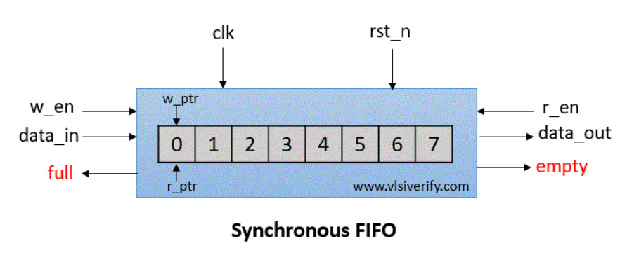
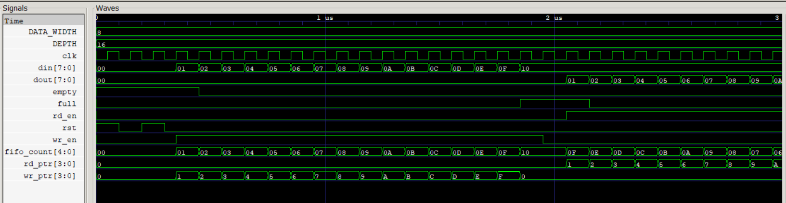

# Synchronous FIFO
In Synchronous FIFO, data read and write operations use the same clock frequency. Usually, they are used with high clock frequency to support high-speed systems.

## Block Diagram

## Signal 
wr_en: write enable  
din[7:0]/wr_data: write data  
full: FIFO is full  
empty: FIFO is empty  
rd_en: read enable  
dout[7:0]/rd_data: read data  
w_ptr: write pointer  
r_ptr: read pointer  

## Timing Diagram

